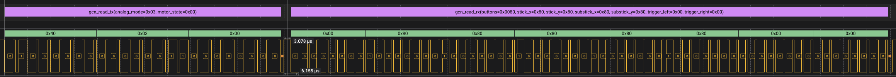

# libjoybus

An implementation of the Joybus protocol used by N64 and GameCube controllers,
for 32-bit microcontrollers.



## Features

- C implementation, no external dependencies (besides backend-specific SDKs)
- Provides both *host mode* and *target mode* functionality
- *Host mode* allows communication with N64/GameCube controllers from a microcontroller
- *Target mode* allows you to build custom N64/GameCube controllers using a microcontroller
- Near-ASIC timing accuracy for reliable communication
- Pre-built targets for N64 controllers and GameCube controllers

## Supported Platforms

- Raspberry Pi Pico and Pico 2 (and other RP2xxx-based boards)
- Silicon Labs EFR32 Series 1 and Series 2 MCUs

## Examples

The project is used in [WavePhoenix](https://github.com/loopj/wavephoenix), an open source implementation of a GameCube WaveBird receiver.

You can find a number of additonal examples in the [`examples/`](examples/) directory, including a [full implementation of the official Nintendo GameCube Controller Adapter for Pi Pico](examples/pico-sdk/gcn-adapter-nintendo).

Please let me know if you build something with `libjoybus`! I love seeing my projects used in the wild, and I'll consider adding it to the examples list!

## Usage

You can find the [full API documentation here](https://loopj.com/libjoybus/), but here are some basic examples to get you started.

### Initializing the Joybus

Before using `libjoybus`, you need to initialize the Joybus interface for your
platform. Here's an example for the RP2040:

```c
#include <joybus/joybus.h>
#include <joybus/backend/rp2xxx.h>

struct joybus_rp2xxx rp2xxx_bus;
struct joybus *bus = JOYBUS(&rp2xxx_bus);

int main() {
  // Initialize the Joybus on a specific GPIO pin and PIO instance
  joybus_rp2xxx_init(&rp2xxx_bus, JOYBUS_GPIO, pio0);

  // ...your code here

  return 0;
}
```

### Communicating with Controllers

In *host mode*, `libjoybus` allows a microcontroller to communicate with N64 and
GameCube controllers. This allows you to use input data from N64 and GameCube
controllers in your projects.

```c
#include <joybus/joybus.h>

struct joybus_rp2xxx rp2xxx_bus;
struct joybus *bus = JOYBUS(&rp2xxx_bus);

void read_controller() {
  // Read a GameCube controller in analog mode 3 with the rumble motor off
  struct joybus_gcn_controller_state input;
  int rc = joybus_gcn_read(bus, JOYBUS_GCN_ANALOG_MODE_3, JOYBUS_GCN_MOTOR_STOP, &input);
  if (rc < 0) {
    // ...handle read error
    return;
  }

  // Do something with the input state
  if (input.buttons & JOYBUS_GCN_BUTTON_A) {
    // The A button is pressed
  }
}

void main() {
  // Initialize the Joybus
  joybus_rp2xxx_init(&rp2xxx_bus, MY_GPIO, pio0);
  joybus_enable(bus);

  // Read the controller state in a loop
  while (1) {
    read_controller();
    sleep_ms(10);
  }
}
```

### Emulating a Controller

In *target mode*, `libjoybus` allows a microcontroller to act as an N64 or GameCube
controller. This allows you to create custom controllers that can interface with
N64, GameCube, and Wii consoles.

I've provided built-in targets for N64 controllers and GameCube controllers so you can just populate the input state and let `libjoybus` handle the rest.

```c
#include <joybus/joybus.h>

struct joybus_rp2xxx rp2xxx_bus;
struct joybus *bus = JOYBUS(&rp2xxx_bus);
struct joybus_target_gcn_controller controller;

void main() {
  // Initialize and enable the Joybus
  joybus_rp2xxx_init(&rp2xxx_bus, MY_GPIO, pio0);
  joybus_enable(bus);

  // Initialize a GameCube controller target and register it on the bus
  joybus_target_gcn_controller_init(&controller);
  joybus_target_register(bus, JOYBUS_TARGET(&controller));

  // At this point the target will respond to commands from a connected console!
  // Modify the input state as needed, for example based on GPIO or ADC readings
  while (1) {
    // Clear previous button state
    controller.input.buttons &= ~JOYBUS_GCN_BUTTON_MASK;

    // Simulate pressing the A button
    controller.input.buttons |= JOYBUS_GCN_BUTTON_A;

    // Simulate setting the analog stick position
    controller.input.stick_x = 200;
    controller.input.stick_y = 200;

    sleep_ms(10);
  }
}
```

## License

This project is licensed under the MIT License. See the [LICENSE](LICENSE) file for details.
