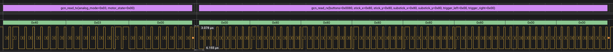

# libjoybus

An implementation of the Joybus protocol used by N64 and GameCube controllers,
for 32-bit microcontrollers.



## Features

- C implementation, no external dependencies (besides backend-specific SDKs)
- Provides both *host mode* and *target mode* functionality
- *Host mode* allows communication with N64/GameCube controllers from a microcontroller
- *Target mode* allows you to build custom N64/GameCube controllers using a microcontroller
- Near-ASIC timing accuracy for reliable communication
- Pre-built targets for N64 controllers and GameCube controllers

## Supported Platforms

- Raspberry Pi Pico and Pico 2 (and other RP2xxx-based boards)
- Silicon Labs EFM32/EFR32 Series 1 and Series 2 MCUs
- Espressif ESP32 (ESP32-C3, ESP32-C6, ESP32-S3, ESP32-H2)

## Examples

libjoybus is a key part of [WavePhoenix](https://github.com/loopj/wavephoenix), my open source implementation of a GameCube WaveBird receiver.

libjoybus is also used in my [open-source 4-port USB GameCube controller adapter](https://github.com/loopj/usb-gamecube-controller-adapter) project.

You can find a number of additional examples in the [`examples/`](examples/) directory.

Please let me know if you build something with `libjoybus`! I love seeing my projects used in the wild, and I'll consider adding it to the examples list!

## Installation

### CMake Based Projects (Pico SDK, etc)

Copy the library into your project, add it as a git submodule, or fetch it with `FetchContent`. Set your `JOYBUS_BACKEND`, for example `rp2xxx` for the Pico SDK, and link your executable against the `joybus` target:

```cmake
# Set the backend (after pico_sdk_init() on the Pico SDK)
set(JOYBUS_BACKEND rp2xxx)

# Download libjoybus as part of a build, using FetchContent
include(FetchContent)
FetchContent_Declare(libjoybus GIT_REPOSITORY https://github.com/loopj/libjoybus.git GIT_TAG main)
FetchContent_MakeAvailable(libjoybus)

# ...or if bundling as a copy or git submodule
add_subdirectory(libjoybus)

# Link your executable against the joybus target
target_link_libraries(my_app pico_stdlib joybus)
```

See the [Pico SDK examples](examples/pico-sdk/) for complete projects.

### ESP32 (ESP-IDF)

For ESP-IDF projects, libjoybus is packaged as a component. From your project directory, add it as a git dependency:

```bash
idf.py add-dependency --git https://github.com/loopj/libjoybus.git libjoybus
```

Then add `libjoybus` to the `REQUIRES` list in your `main/CMakeLists.txt`:

```cmake
idf_component_register(SRCS "main.c" INCLUDE_DIRS "." REQUIRES libjoybus)
```

The component manager downloads libjoybus on the next `idf.py build`. See the [ESP-IDF examples](examples/esp32/) for complete projects.

### Silicon Labs EFM32/EFR32 (Simplicity SDK)

For Simplicity SDK projects, libjoybus is packaged as a Silicon Labs SDK extension.

#### Via Simplicity Studio

1. Follow the [Silicon Labs Guide](https://docs.silabs.com/simplicity-studio-5-users-guide/latest/ss-5-users-guide-getting-started/install-sdk-extensions) to add this repository as an extension.

2. Open your project's *Software Components* tab and install the `libjoybus` component.

#### Using SLC-CLI

Clone into your SDK's `extension` folder and trust the extension:

```bash
slc signature trust -extpath <path_to_sdk>/extension/libjoybus
```

Add to your project's `.slcp` file:

```yaml
sdk_extension:
  - id: libjoybus
    version: 0.9.0

component:
  - id: libjoybus
    from: libjoybus
```

See the [Gecko examples](examples/gecko/) for complete projects.

## Usage

You can find the [full API documentation here](https://loopj.com/libjoybus/), but here are some basic examples to get you started.

### Initializing the Joybus

Before using `libjoybus`, you need to initialize the Joybus interface for your
platform. Here's an example for the RP2040:

```c
#include <joybus/joybus.h>
#include <joybus/backend/rp2xxx.h>

struct joybus_rp2xxx rp2xxx_bus;
struct joybus *bus = JOYBUS(&rp2xxx_bus);

int main() {
  // Initialize the Joybus on a specific GPIO pin and PIO instance
  joybus_rp2xxx_init(&rp2xxx_bus, joybus_rp2xxx_config_default(JOYBUS_GPIO));

  // ...your code here

  return 0;
}
```

### Communicating with Controllers

In *host mode*, `libjoybus` allows a microcontroller to communicate with N64 and
GameCube controllers. This allows you to use input data from N64 and GameCube
controllers in your projects.

```c
#include <joybus/joybus.h>

struct joybus_rp2xxx rp2xxx_bus;
struct joybus *bus = JOYBUS(&rp2xxx_bus);

void read_controller() {
  // Read a GameCube controller in analog mode 3 with the rumble motor off
  struct joybus_gcn_controller_state input;
  int rc = joybus_gcn_read(bus, JOYBUS_GCN_ANALOG_MODE_3, JOYBUS_GCN_MOTOR_STOP, &input);
  if (rc < 0) {
    // ...handle read error
    return;
  }

  // Do something with the input state
  if (input.buttons & JOYBUS_GCN_BUTTON_A) {
    // The A button is pressed
  }
}

void main() {
  // Initialize the Joybus and enable it in host mode
  joybus_rp2xxx_init(&rp2xxx_bus, joybus_rp2xxx_config_default(MY_GPIO));
  joybus_enable(bus, JOYBUS_MODE_HOST);

  // Read the controller state in a loop
  while (1) {
    read_controller();
    sleep_ms(10);
  }
}
```

### Emulating a Controller

In *target mode*, `libjoybus` allows a microcontroller to act as an N64 or GameCube
controller. This allows you to create custom controllers that can interface with
N64, GameCube, and Wii consoles.

I've provided built-in targets for N64 controllers and GameCube controllers so you can just populate the input state and let `libjoybus` handle the rest.

```c
#include <joybus/joybus.h>

struct joybus_rp2xxx rp2xxx_bus;
struct joybus *bus = JOYBUS(&rp2xxx_bus);
struct joybus_target_gcn_controller controller;

void main() {
  // Initialize the Joybus
  joybus_rp2xxx_init(&rp2xxx_bus, joybus_rp2xxx_config_default(MY_GPIO));

  // Initialize a GameCube controller target and attach it to the bus
  joybus_target_gcn_controller_init(&controller);
  joybus_attach_target(bus, JOYBUS_TARGET(&controller));

  // Enable the Joybus in target mode
  joybus_enable(bus, JOYBUS_MODE_TARGET);

  // At this point the target will respond to commands from a connected console!
  // Modify the input state as needed, for example based on GPIO or ADC readings
  while (1) {
    // Clear previous button state
    controller.input.buttons &= ~JOYBUS_GCN_BUTTON_MASK;

    // Simulate pressing the A button
    controller.input.buttons |= JOYBUS_GCN_BUTTON_A;

    // Simulate setting the analog stick position
    controller.input.stick_x = 200;
    controller.input.stick_y = 200;

    sleep_ms(10);
  }
}
```

## License

This project is licensed under the MIT License. See the [LICENSE](LICENSE) file for details.
